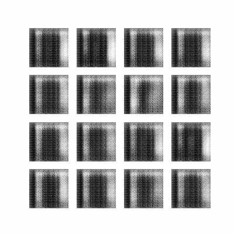

# DCGAN On Different Datasets
***Implement a GAN for Celeb_a dataset to generate celebrities faces***
## This task solved with this repo
- CelebFaces Attributes Generator: I trained a DCGAN on [Celeb_A Dataset](https://www.kaggle.com/datasets/jessicali9530/celeba-dataset)


## How to install
### Run this command:
```bash
pip install -r requirements.txt
```

# CelebFaces Attributes
### CelebFaces Attributes Training Duration

<br>
*you can download the weight of it from [here](https://drive.google.com/drive/folders/1rl--QHHsTFBpOcR8Y1Qr-FCt8H7Iw6D8?usp=sharing) if you want to.*
